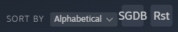

# Easy SteamGrid

A Millennium plugin that adds quick and easy SteamGridDB integration to Steam.

## Features
- Replace or reset grid images for all apps in a collection with ones from SteamGridDB
- Switch the header image, logo or grid image of an app with ones from SteamGridDB via a panel opened by double-clicking the header

## Configuration
- Configuration file: `<STEAM>\plugins\steam-easygrid\config.json`
- Set `api_key` to your [SteamGridDB API key](https://www.steamgriddb.com/profile/preferences/api)
- Fallback to searching by name can be disabled by setting `display_name_fallback` to `false`
- When replacing all grid images in a collection, to disable skipping apps with a custom grid already set by the plugin, set `replace_custom_images` to `false`
- When replacing all grid images in a collection, to skip a given app, add it to the `appids_excluded_from_replacement` list
- To prioritize animated images, set `prioritize_animated` to `true`
- `grids_config`, `heroes_config` and `logos_config` can be set to a dictionary with any extra parameters you want to add to the API queries

## Prerequisites
- [Millennium](https://steambrew.app/)
- [SteamGridDB API key](https://www.steamgriddb.com/profile/preferences/api)

## Known issues:
- Double clicking the header will sometimes open the panel twice
    - In this case, just close one of them
- Be patient, every change can take a couple seconds

## Contributors

Made with [contrib.rocks](https://contrib.rocks).

## HowTo/Screenshots/Problemsolving

# First run

- Get your [SteamGridDB API key](https://www.steamgriddb.com/profile/preferences/api)
- Fill the field `api_key` in `<STEAM>\plugins\steam-easygrid\config.json`
- Restart Steam

# Using Grid images from SteamGridDB for entire Collections - from Home

- In the Steam Library, search for the `SGDB` button
- The button should look like the one here (on the default skin):

- Click the button and select a Collection to work on - example list:

- The progress will be displayed while working - example:

# Using Grid images from SteamGridDB for entire Collections - from a Collection

- Select a collection (using the Collections page or the left pane)
- Search for the `SGDB` and `Rst` buttons, they should look lik this (on the default skin):

- Click the `SGDB` button to replace all Grid images in the collection
- Click the `Rst` button to reset all Grid images in the collection
- The progress will be displayed while working

# Using Headers (heroes), Logos and Grids from SteamGridDB

- Double-click the header of an app
- A small panel should appear with the settings
    - The panel appears on the right side of the header (on the default skin) as such:

- The following controls are shown:
    - Number selectors for the Hero (header), Logo and Grid; Reset button (sets it to -1)
    - Purge Cache button: Purges all cached links and files for the given app, forcing a new search and new downloads
        - This is a good first try when something stops working
    - Close button
    - Below the Close button, the currently selected Grid image is displayed (if any)
- Image numbers start at 0, with -1 meaning "not set"

## Troubleshooting

When someting stop working, a good first step is to try pruging the cache of the given app:
- Double-click the header of the app
- Click `Purge Cache`, this will purge cached links and files
- Double-click the header again, this should force a new search on SGDB, hopefully fixing the problem