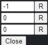

# Easy SteamGrid

A Millennium plugin that adds quick and easy SteamGridDB integration to Steam.

## Features
- Replace or reset grid images for all apps in a collection with ones from SteamGridDB
- Switch the header image, logo or grid image of an app with ones from SteamGridDB via a panel opened by double-clicking the header

## Configuration
- Configuration file: `<STEAM>\plugins\steam-easygrid\config.json`
- Set `api_key` to your [SteamGridDB API key](https://www.steamgriddb.com/profile/preferences/api)
- Fallback to searching by name can be disabled by setting `display_name_fallback` to `false`
- `extra_config` can be set to a dictionary with any extra parameters you want to add to the API queries

## Prerequisites
- [Millennium](https://steambrew.app/)
- [SteamGridDB API key](https://www.steamgriddb.com/profile/preferences/api)

## Known issues:
- The new menu button doesn't alway appear the first time the Library tab is opened
    - This also renders the doubleclick handler non-functional
    - To fix this, click the Library tab again
- Only works if an app is selected from the left panel, **not** from the grid
- Double clicking the header will sometimes open the panel twice
    - In this case, just close one of them
- Be patient, every change can take a couple seconds

## HowTo/Screenshots/Problemsolving

# First run

- Get your [SteamGridDB API key](https://www.steamgriddb.com/profile/preferences/api)
- Fill the field `api_key` in `<STEAM>\plugins\steam-easygrid\config.json`
- Restart Steam

# Using Grid images from SteamGridDB for entire Collections

- In Steam, click Library, then search for the `SGDB` button
- If the button doesn't appear, click Library again (known issue)
- The button should look like the one here (on the default skin):

- Click the button and select a Collection to work on - example list:

- The progress will be displayed while working - example:

# Using Headers (heroes), Logos and Grids from SteamGridDB

- In Steam, click Library, then wait for the `SGDB` button to appear
- If the button doesn't appear, click Library again (known issue)
- Click an app in the left panel
- Double-click the header
- A small panel should appear with the settings
    - The panel appears on the right side of the header (on the default skin) as such:

- The following controls are shown:
    - First row: Header (hero) image number, Reset button (sets it to -1)
    - Second row: Logo image number, Reset button (sets it to -1)
    - Third row: Grid image number, Reset button (sets it to -1)
    - Close button
    - Below the Close button, the currently selected Grid image is displayed (if any)
- Image numbers start at 0, with -1 meaning "not set"