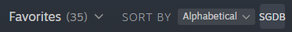
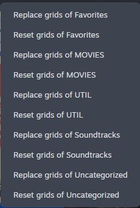
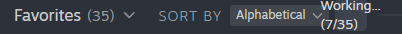

# Easy SteamGrid

A Millennium plugin that adds quick and easy SteamGridDB integration to Steam.

## Features
- Replace or reset grid images for all apps in a collection with ones from SteamGridDB
- Switch the Background image (hero), Logo, Cover image (grid), Wide Cover image (wide grid) or Icon of an app with ones from SteamGridDB via a window opened by double-clicking the header
    - Or automatically switch all images of an app using the `SG` button
- Set custom height for the Background image (hero)

## Configuration
- Configuration file: `<STEAM>\plugins\steam-easygrid\config.json`
- Set `api_key` to your [SteamGridDB API key](https://www.steamgriddb.com/profile/preferences/api)
- Fallback to searching by name can be disabled by setting `display_name_fallback` to `false`
- When replacing all grid images in a collection, to disable skipping apps with a custom grid already set by the plugin, set `replace_custom_images` to `false`
- When replacing all grid images in a collection, to skip a given app, add it to the `appids_excluded_from_replacement` list
- To prioritize animated images, set `prioritize_animated` to `true`
- To set a custom Background image (hero) height, set `expand_headers` to the desired value (e.g. `530px` or `1240px`)
- `grids_config`, `wide_grids_config`, `heroes_config`, `logos_config` and `icons_config` can be set to a dictionary with any extra parameters you want to add to the API queries
    - The documentation for all API parameters can be found here: [https://www.steamgriddb.com/api](https://www.steamgriddb.com/api)
- `grids_width_mult`, `heroes_width_mult` and `logos_width_mult` can be modified to scale images in the UI

## Prerequisites
- [Millennium](https://steambrew.app/)
- [SteamGridDB API key](https://www.steamgriddb.com/profile/preferences/api)

## Known issues:
- Be patient, every change can take a couple seconds
- The whole page might not update when clicking "Purge Cache", until you change pages and change back
- Setting icons doesn't work at the moment
- `Auto Replace Images` sometimes fails setting the Wide Grid image

## Contributors

Made with [contrib.rocks](https://contrib.rocks).

## HowTo/Screenshots/Problemsolving

# First run

- Get your [SteamGridDB API key](https://www.steamgriddb.com/profile/preferences/api)
- If the file `<STEAM>\plugins\steam-easygrid\config.json` doesn't exist, make a copy of `defaults.json` and name it `config.json`
- Fill the field `api_key` in `<STEAM>\plugins\steam-easygrid\config.json`
- Restart Steam

# Using Grid images from SteamGridDB for entire Collections - from Home

- In the Steam Library, search for the `SGDB` button
- The button should look like the one here (on the default skin):

- Click the button and select a Collection to work on - example list:

- The progress will be displayed while working - example:

# Using Grid images from SteamGridDB for entire Collections - from a Collection

- Select a collection (using the Collections page or the left pane)
- Search for the `SGDB` button, it should look like this (on the default skin):

- Click the `SGDB` button and select your course of action: replace or reset all Grid images in the collection
- The progress will be displayed while working

# Using all images from SteamGridDB

- Double-click the header of an app
- A window should appear with the settings
- In the left pane, secect the type of image you want to replace
- In the right page, click the image you want to use
- The following extra controls are shown:
    - `Reset` button: Resets the image back to the default one
    - `Purge Cache` button: Purges all cached links and files for the given app, forcing a new search and new downloads
        - This is a good first try when something stops working
    - `Open Webpage` button: Opens the app's SGDB webpage in your browser
- Image numbers start at 0, with -1 meaning "not set"

## Troubleshooting

If the plugin doesn't find any art for an app, click the `Open Webpage` button to check if the plugin is broken, or there really isn't any art to see

When someting stops working, a good first step is to try pruging the cache of the given app:
- Double-click the header of the app
- Click `Purge Cache`, this will purge cached links and files, hopefully fixing the problem

If purging the cache doesn't fix the problem, try the nuclear option:
- Delete the database stored at `<STEAM>\plugins\steam-easygrid\game_db.json`
- Delete the cache stored at `<STEAM>\plugins\steam-easygrid\artcache`
- Restart Steam