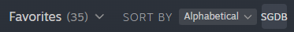
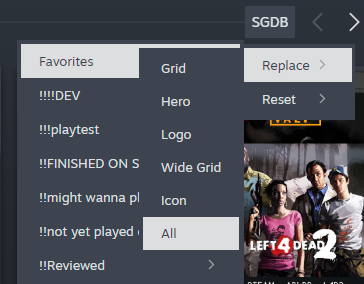
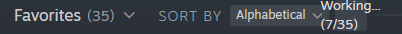
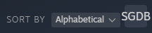
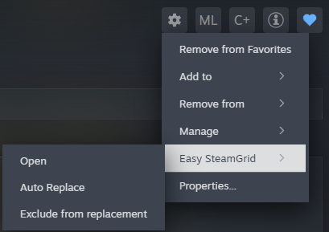

# Easy SteamGrid

A Millennium plugin that adds quick and easy SteamGridDB integration to Steam.

## Features
- Replace or reset grid images for all apps in a collection with ones from SteamGridDB
- Switch the Background image (hero), Logo, Cover image (grid), Wide Cover image (wide grid) or Icon of an app with ones from SteamGridDB via a window opened by double-clicking the header
    - Or automatically switch all images of an app using the `SG` button
- Set custom height for the Background image (hero)
    - Good ones are e.g. `530px` or `1240px`

## Notices
- The plugin needs an API key to work, set it in the Configuration
- Setting icons can be enabled in the Configuration
    - Feature might or might not work
- WEBP art has been disabled by default, as it caused crashes for some users
    - Can be enabled in the Configuration

## Configuration
- Configuration options are available through the Millennium Library Manager

## Prerequisites
- [Millennium](https://steambrew.app/)
- [SteamGridDB API key](https://www.steamgriddb.com/profile/preferences/api)

## Installation
- Copy the plugin ID from the [Millennium plugins](https://steambrew.app/plugins) page
- Click `Plugins` and `Install a plugin` in the Millennium settings and paste the ID
- Allow 10 seconds for the plugin to load after each startup

## Known issues:
- Be patient, every change can take a couple seconds
- The whole page might not update when clicking "Purge Cache", until you change pages and change back
- Setting icons might or might not work
- `Auto Replace Images` sometimes fails setting the Wide Grid image
- If the plugin doesn't work, or randomly stops working, check [Troubleshooting](#troubleshooting)
- Trying to set WebP files might crash Steam on Linux
    - MIME types are overridable in the Configuration

## Contributors

Made with [contrib.rocks](https://contrib.rocks).

## HowTo/Screenshots

# First run

- Get your [SteamGridDB API key](https://www.steamgriddb.com/profile/preferences/api)
- Open the Millennium Library Manager
- Click on Easy SteamGrid
- Paste your API key into the textbox

# Using Grid images from SteamGridDB for entire Collections - from Home

- In the Steam Library, search for the `SGDB` button
- The button should look like the one here (on the default skin):

- Click the button and select a Collection to work on - example list:

- The progress will be displayed while working - example:

# Using Grid images from SteamGridDB for entire Collections - from a Collection

- Select a collection (using the Collections page or the left pane)
- Search for the `SGDB` button, it should look like this (on the default skin):

- Click the `SGDB` button and select your course of action: replace or reset all Grid images in the collection
- The progress will be displayed while working

# Using all images from SteamGridDB

- Double-click the header of an app
    - ...or click the `SG` button near the `Show game details` button, and select `Open window` from the menu
- A window should appear with the settings
- In the left pane, secect the type of image you want to replace
- In the right page, click the image you want to use
- The following extra controls are shown:
    - `Reset` button: Resets the image back to the default one
    - `Purge Cache` button: Purges all cached links for the given app, forcing a new search and new downloads
        - This is a good first try when something stops working
    - `Open Webpage` button: Opens the app's SGDB webpage in your browser

# Using all images from SteamGridDB (but automatically)

- Click the `SG` button near the `Show game details` button
- Select `Auto replace images` from the menu

## Troubleshooting

If the plugin doesn't find any art for an app, click the `Open Webpage` button to check if the plugin is broken, or there really isn't any art to see

When someting stops working, a good first step is to try pruging the cache of the given app:
- Double-click the header of the app
- Click `Purge Cache`, this will purge cached links and files, hopefully fixing the problem
